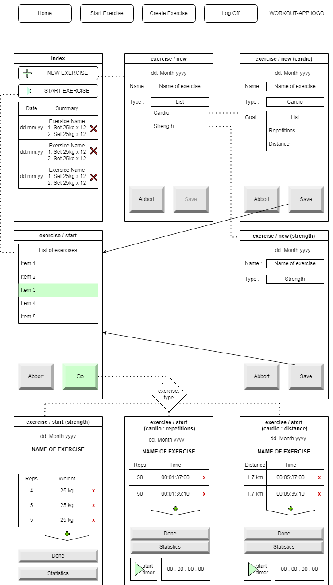
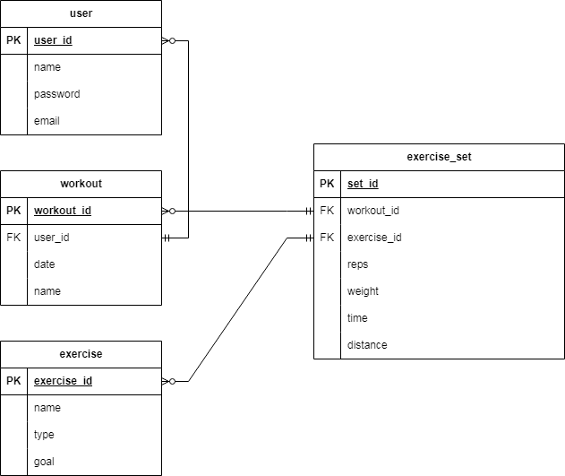
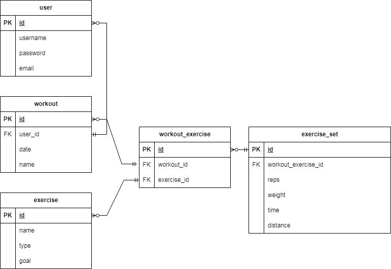
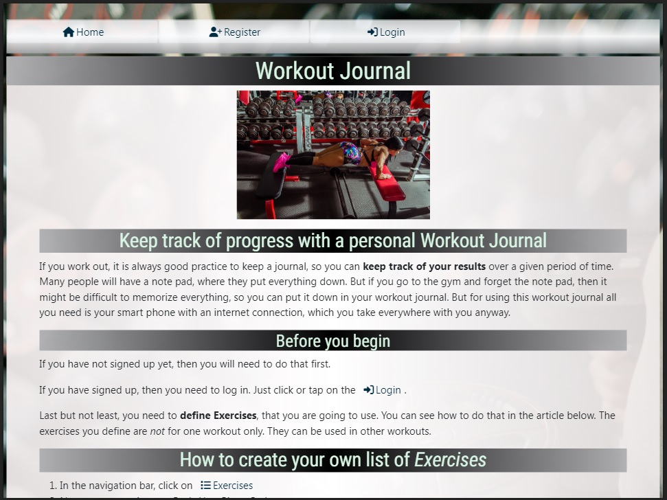
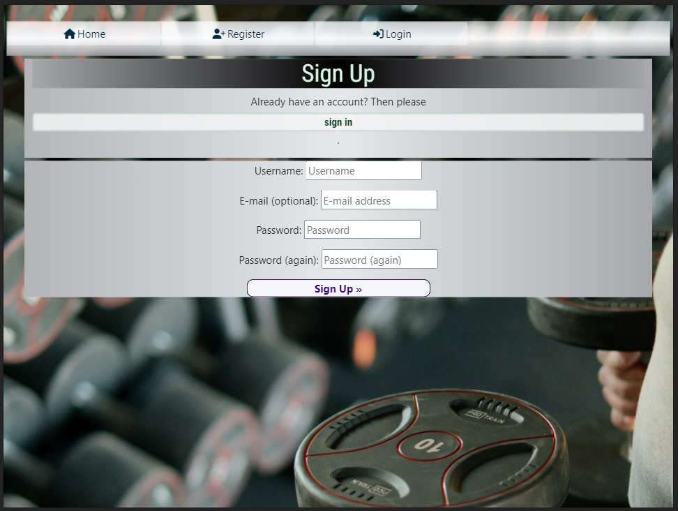
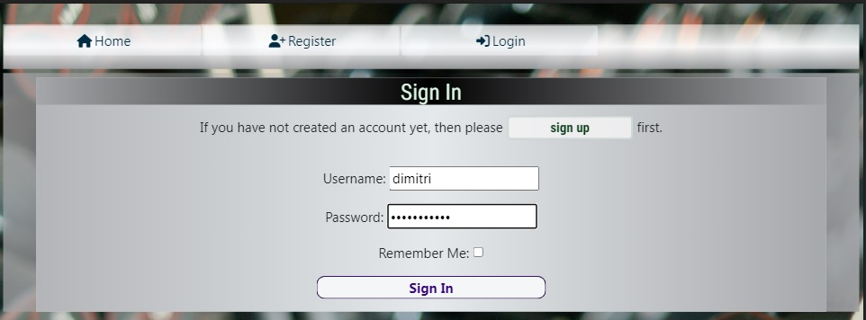
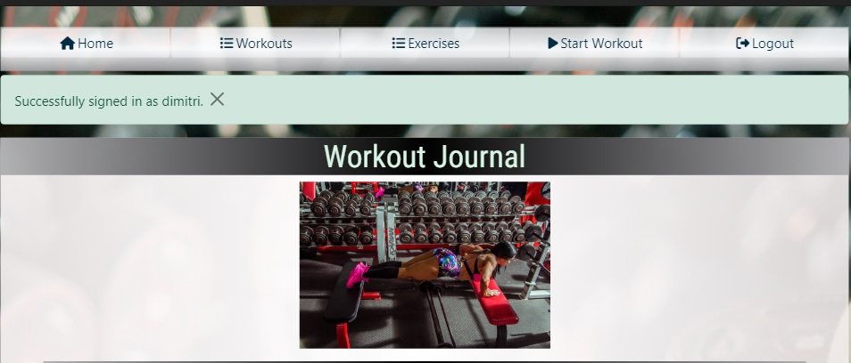
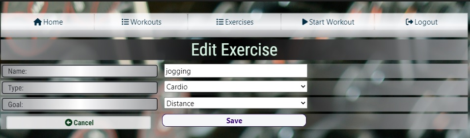
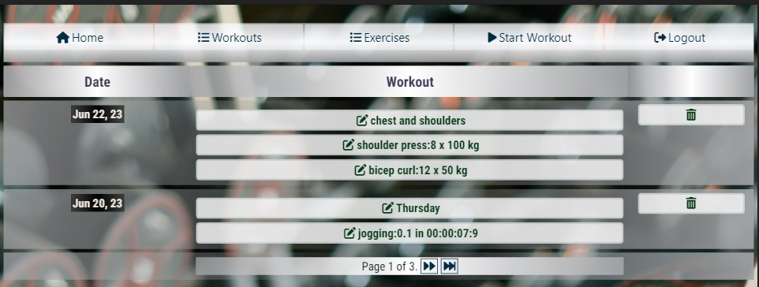

# workout-app
## Introduction
 If you work out, it is always good practice to keep a journal, so you can **keep track of your results**. Many people will have a note pad, where they put everything down. But if you go to the gym and forget the note pad, then it might be difficult to memorize everything, so you can put it down in your workout journal. But for using this workout journal all you need is your smart phone with an internet connection, which you take everywhere with you anyway.
## Issues
Due to some misunderstandings along the way, three weeks before submission date, I learned that I had to use django and not Flask for this projects. Only because of how well documented and well organized django is, could I learn and develop at the same time. 
The actual problem, though, came up three days before submission, as I was already beginning to work on this README.MD file. What happened was that I learned from my mentor, that the django adminstraion sites, do not count as the real admin sites. Thus, I have to implement my own admin interface. So, I whipped up an interface, that I would not put out in the real world. This interface merely serves as a means to show the assesment team, that if I had planned that in, it would not have been an issue. This mishap took away a huge chunk of the time that was planned on providing a good documentation. 
### My Server does not have an SSL-Certificate yet
This is more of a financial issue at the moment. Due to lack of SSL, the server is not capable of enstablishing a secure https connection. But this is only a presentation and not a comercial website. 

## First design
### Wireframe
This was the initial thought. Yet, in the process I realized that I missed out a couple of views.

### ERD
As mentioned before, I missed a few views in the intial wirefraem, which also means that the first ERD was missing one model class. However, this was the first draft.

## Final Design
### ERD
This is what the databse looks like after I have added the missing part.

## Use cases
### Home page
This is the landing page of the web application

### Registration
I did not get around to properly styling this **allauth-form** yet. This is what it looks like as of now.

### Login
Customized allauth form.

Upon signing in, the user gets redirected to the home page. More items appear on the navigation bar and a message,
notifying the user that they have just logged in, appears.

### Exercises
In order to use start working out, the user needs to define a set of exercises that they intend to use in their workouts.
If the user clicks on **Exercises** button in the navigation bar, a page with their exercises will open. The **illustration below** already **contains some exercises**. Yet if the user has **not created any**, the list will be **empty**.
On this page the user can edit their **own list of exercies** as they see fit. They can add new ones, **delete execises**.
Deleting will only work, **if the exercise has not been used** in a workout. If they want to edit an **existing exercise** they can do so, by simply **clicking** on the **name of the exercise** in the list.

They can also edit the name of the exercise and their type, 

### Workout List
The user can see all the workouts that they have done. In the left column they can see the date on which the respective 
workout took place. In the second column, they can see several links. One of them is the name of the workout and when clicked, they can edit the workout. The other links are summaries of each exercise in that workout. In the third column 
they can see an icon that looks like a trash can, which will allow them to delete this workout.

In the illustration below you can see an example of what it looks like when there already are some workouts in the list, 
because I loggged in as an already existing user. 

## Testing
## Bugs
### BUG-FIX # 1 (Not relevant anymore)
This bugfix is not relevant, because I redesigned the application. And using Formsets became unnecessary.

**class: EditExerciseSet**
#### Issue:
Formsets work fine in the get method, yet in the post method they come up uninitialized.
#### Solution: 
add  to the three templates that the view uses for rendering

### BUG-FIX #2:
**class EditExerciseList**
#### Issue:
Since the URL does not use any parameters, yet the template is designed to be able to 
add new datasets to the model, I did not provide instance to the form in the post method.
Which lead to faulty behaviour.
#### Solution:
I store the id of the object that is used in the form in the get-method in request.session.
Then, pull the id from the request.session and use it to get an instance of the exercise,
from the model. Then assign this instance to the form.

### BUG-FIX #3:
**class EditWorkout**

#### Issue:
The the QuerySet in the view kept coming up in a random order. As a result the editable form for
for a new exercise in the workout (type: WorkoutExercise) was one from the already existing EditExerciseSet
in this very same workout. So changing it would change one of the existing datesets.

#### Solution:
I forgot to erase a line of code, that I had used for creating a formset, so all the datasets were editable.
The instanciation of a formset requires a query. The query was reordering the QuerySet. I simply removed
that line from the code and thing came back to normal.

### BUG-FIX #4:
**class WorkoutExerciseForm**

#### Issue:
In the view AddWorkout.get(). In the workout_exercie_form, the list of exercises is not linked to the current user.

#### Solution:
Add a queryset to the form, like so:
<code>
self.fields['exercise'].queryset = Exercise.objects.filter(user_id=user_id)
</code>

### BUG-FIX #5:
**class WorkoutExerciseForm**

#### Issue:
Upone changing to Form to fix the previous bug. Other views that use this form, started raising Errors. It came down to 
the fact that the constructor now required a user_id field, which those other views were not providing it with.
Simple adding the user_id to to the list of arguements, worked for get methods. Yet in the post methods, the request.POST 
object must be passed to the constructor, so it can pass it down to the super()-constructor. And since request.POST object 
already has user_id, the two parameters clashed with eachother.

#### Solution:
Instead of defining the user_id as a parameter in the constructor, pass it through kwargs and then pop it from the parameter 
stack, like so:
<code>
def __init__(self, *args, **kwargs):
        user_id = kwargs.pop("user_id")
</code>

## Deployment
Before beginning with the project I had rented a Virtual Private Server at IONOS. The server comes with a plain Ubuntu operating system. Most Linux systems come with a pre-installed python interpreter and Ubuntu is one of them. 
1. Install an Apache2 Webserver([Tutorial I used](https://www.digitalocean.com/community/tutorials/how-to-install-the-apache-web-server-on-ubuntu-22-04)) and PostreSQL([Tutorial I used](https://www.digitalocean.com/community/tutorials/how-to-install-postgresql-on-ubuntu-22-04-quickstart)]) on the system. 
3. Configure server for a django application ([Tutorial I used](https://www.digitalocean.com/community/tutorials/how-to-serve-django-applications-with-apache-and-mod_wsgi-on-ubuntu-14-04))
4. Apply changes to **settings.py**, adding **ROOT_URL** and **STATIC_URL** as well as **STATIC_ROOT** .
5. Run the collect static command.

## Technologies
- Django
- Bootstrap
- Virtual Private Server
- PostgresSQL
- Visual Studio Code
- Python
- JavaScript
- HTML & CSS
## Credits
- Code Institute
- Django Documentation
- Bootstrap Documentation
- w3schools.com
- stackoverflow.com
- DigitalOcean
