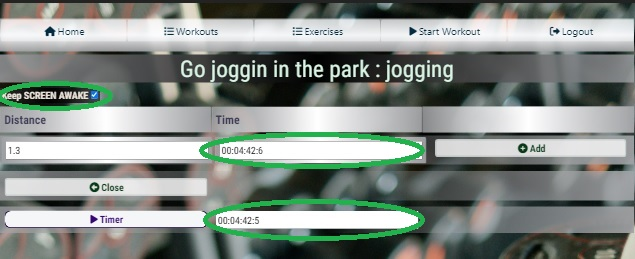

# workout-app

## Introduction
 If you work out, it is always good practice to keep a journal, so you can **keep track of your results**. Many people will have a note pad, where they put everything down. But if you go to the gym and forget the note pad, then it might be difficult to memorize everything, so you can put it down in your workout journal. But for using this workout journal all you need is your smart phone with an internet connection, which you take everywhere with you anyway.
## Issues
Due to some misunderstandings along the way, three weeks before submission date, I learned that I had to use django and not Flask for this projects. 
Here is an excerpt from the assemssment guide:
**LO1**
Use an Agile methodology to plan and design a Full-Stack Web application using an **MVC framework** and related contemporary technologies.
Well, **Flask is  an MVC framework!**.

Only because of how **well documented** and **well organized** django is, could I learn and develop at the same time. What a **great framework!** I doff my hat!
The actual problem, though, came up four days before submission, as I was already beginning to work on this README.MD file. What happened was that I learned from my mentor, that the django adminstraion sites, do not count as the real admin sites. Thus, I have to implement my own admin interface. So, I whipped up an interface, that I would not put out in the real world. It does not cover the entire scope of crud functionality for all models, yet they can be easily added later.This interface merely serves as a means to show the assesment team, that if I had planned that in, it would not have been an issue. This mishap took away a huge chunk of the time that was planned on providing a good **documentation** and a **comrehensive manaul** on the home page. This is the reason why the manual is incomplete for the time being.

## First design
### Wireframe
This was the initial thought. Yet, in the process I realized that I missed out a couple of views.

### ERD
As mentioned before, I missed a few views in the intial wirefraem, which also means that the first ERD was missing one model class. However, this was the first draft.

## Final Design
### ERD
This is what the databse looks like after I have added the missing part.

## User stories
### Home page
This is the landing page of the web application

### Registration
I did not get around to properly styling this **allauth-form** yet. This is what it looks like as of now.

### Login
Customized allauth form.

Upon signing in, the user gets redirected to the home page. More items appear on the navigation bar and a message,
notifying the user that they have just logged in, appears.

### Exercises
In order to start working out, the user needs to define a set of exercises that they intend to use in their workouts.
If the user clicks on **Exercises** button in the navigation bar, a page with their exercises will open. The **illustration below** already **contains some exercises**. Yet if the user has **not created any**, the list will be **empty**.
On this page the user can edit their **own list of exercies** as they see fit. They can add new ones, **delete execises**.
Deleting will only work, **if the exercise has not been used** in a workout. If they want to edit an **existing exercise** they can do so, by simply **clicking** on the **name of the exercise** in the list.

They can also edit the name of the exercise and their type, 

### Workout List
The user can see all the workouts that they have done. In the left column they can see the date on which the respective 
workout took place. In the second column, they can see several links. One of them is the name of the workout and when clicked, they can edit the workout. The other links are summaries of each exercise in that workout. In the third column 
they can see an icon that looks like a trash can, which will allow them to delete this workout.

In the illustration below you can see an example of what it looks like when there already are some workouts in the list, 
because I loggged in as an already existing user. 

### Workout 
To start logging the results of a workout, simply click on **Start Workout** in the navigation menu.

Now, name the workout and select an exercise that you wish to begin with. And click on **Start**.

#### Edit Workout
You can see the name of the workout in the topmost row. The name of the exercise, that you chose to start out with,
is in the left column. In the left column, next to the exercise name, is the delete button.
Underneath the exercise is the row for adding another exercise. 
If you add a new exercise to the workout, it will also auto-save the form. So there is no necessity to save the form thereafter. It is only necessary to save the form if the only thing you have changed is the name of the workout.

##### Adding another exercise
Let us say, you want to another exercise to the workout. Click on **(-- Select Exercise --)** and select an exercise from the list and then click on **Add**.

The newly added exercise will appear in the list.

##### Log results of an exercise of type : Cardio and goal : Distance
If the type of exercise is a cardio exercise and its goal is distance, which jogging is, then you will see a page like this. Now you can enter the distance you have traversed and the time it took you to do so. The time field is actually a text field, so you can type in whatever you please.

 However, there is a **timer** that you can use to facilitate that. Upon stopping the timer the results will appear in the **time field**. Also, if you prefer to keep the screen on, whilest exercising, there is a **check-box** that you can **activate** to do just that. My screen goes into sleep mode after one minute of inactivity, and I pefer not to have to enter the PIN on my cell phone every time I want to log the results of the current exercise. In the picture above you can see that the , so called, **Wake Lock** was activated.When you are **done** with this set, just click on **Add**.

The added exercise will appear in the list

##### Log results of an exercise of type : Cardio and goal : Repetitions
One way to do push-ups is to try and do as many as you can as quickly as possible. Logging this type of exercise is exactly like the previous one. The only difference is that you have a **repetitions** field instead of distance.

##### Log results of an exercise of type : Strength and goal : Repetitions
For the illustraion below, I am using a part from a workout named 'chest and shoulders' and the exercise is 'shoulder press'. The first set was 8 reps with 60 kg. 

### Admin interface

#### Users
The admin interface allows the admin to create and delete users. Also, it allows to search users by username. It does not have to be the whole user name, just a sequence of characters that the username should contain. For instance, there is a user named **mentor**. If you put **men** into the search field, the user **mentor** is still going to show up on the list.

The **links with usernames** can be used for **browsing** through user's workouts.

#### Exercises
The admin can filter exercises of all users. The character sequence in the search field will be looked for in usernames and names of exercises.

## Testing and validation
As I have demonstrated in the **user stories** above, everything works fine as long as the user is doing what they are supposed to. Let's see what happens if the user attempts to do something that they are not intended to do.

### Default validation of django
User registration and login functionality comes from allauth, which has been tested by its developers.
The validation of the fields, in the scope of this project, is handled by django forms. The forms extract the required fields and the input types from the model. So if the user leaves out a required field, the form won't submit and a validation message will appear.

### Custom error messages
In a few cases, I could not get the submit-button element to look like I wanted it to. There seems to be some CSS attributes that I didn't manage to override. I have just tryed to do it again, but couldn't do it. However, instead of using a submit button, I resorted to using an **anchor**, which is easy to style. And I used **inline javascript** at the bottom of the html-document to submit the form.
<code>
function submit_form() {
        document.forms[0].submit();
    }
</code>
The **drawback** of this approach is that the django form validation goes out of the window. I do not know why and I could not find out the reason. So I had to manually send a message to the user informing them about the validation error.
Below is an illustration of such a message.

**This message incurs if the user tries to add an exercise, but forgets to name it.**

### Deleting exercise that is used in existing workouts
For instance, the user tries to delete an exercise named jogging from the list of exercises.

**Now they press 'Yes'**

**An error message is sent to the user**

### Manual Testing Scenarios
### Allauth 
- Registration works
- Login works
- Logout works

#### Exercise List
- New exercises can be created
- Validation works
- Deleting an exercise that is already in use yields an error message to the user
- The exercise list only shows the exercises defined by the currently logged in user

#### Create Workout(Start Workout)
- Validation in the form works
- The workout is created acurately and the selected exercise is added to the corresponding model(WorkoutExercise)

#### Workout (Edit Workout)
- Validation works
- Adding new exercise works
- Confirmation dialog for deleting works
- Deleting works
- Renaming works

#### Exercise Sets 
This is where the actual logging of results happens
- WakeLock works
- Timer works properly
- Validation not required (Fields are allowed to stay blank)
- Deleting works (**intentionally** no confirm dialog)
- Adding a new set works

#### Workout List
- The workout lists show up for different users correctly
- The last workout shows up first (sorted by date)
- The pagination works properly
- The Confirm Delete Dialog works properly
- The links for editting workouts work properly
- The links for editting exercises in a given workout work properly
#### Rerouting URL requests depnnding on user role
- If admin signs in, they get redirected to admin-users page
- If a user is **not** signed in, but the request a **URL** such as edit_workout/4 or something like this, they get redirected to the login page

## Bugs
### BUG-FIX # 1 (Not relevant anymore)
This bugfix is not relevant, because I redesigned the application. And using Formsets became unnecessary.

**class: EditExerciseSet**
#### Issue:
Formsets work fine in the get method, yet in the post method they come up uninitialized.
#### Solution: 
add  to the three templates that the view uses for rendering

### BUG-FIX #2:
**class EditExerciseList**
#### Issue:
Since the URL does not use any parameters, yet the template is designed to be able to 
add new datasets to the model, I did not provide instance to the form in the post method.
Which lead to faulty behaviour.
#### Solution:
I store the id of the object that is used in the form in the get-method in request.session.
Then, pull the id from the request.session and use it to get an instance of the exercise,
from the model. Then assign this instance to the form.

### BUG-FIX #3:
**class EditWorkout**

#### Issue:
The the QuerySet in the view kept coming up in a random order. As a result the editable form for
for a new exercise in the workout (type: WorkoutExercise) was one from the already existing EditExerciseSet
in this very same workout. So changing it would change one of the existing datesets.

#### Solution:
I forgot to erase a line of code, that I had used for creating a formset, so all the datasets were editable.
The instanciation of a formset requires a query. The query was reordering the QuerySet. I simply removed
that line from the code and thing came back to normal.

### BUG-FIX #4:
**class WorkoutExerciseForm**

#### Issue:
In the view AddWorkout.get(). In the workout_exercie_form, the list of exercises is not linked to the current user.

#### Solution:
Add a queryset to the form, like so:
<code>
self.fields['exercise'].queryset = Exercise.objects.filter(user_id=user_id)
</code>

### BUG-FIX #5:
**class WorkoutExerciseForm**

#### Issue:
Upone changing to Form to fix the previous bug. Other views that use this form, started raising Errors. It came down to 
the fact that the constructor now required a user_id field, which those other views were not providing it with.
Simple adding the user_id to to the list of arguements, worked for get methods. Yet in the post methods, the request.POST 
object must be passed to the constructor, so it can pass it down to the super()-constructor. And since request.POST object 
already has user_id, the two parameters clashed with eachother.

#### Solution:
Instead of defining the user_id as a parameter in the constructor, pass it through kwargs and then pop it from the parameter 
stack, like so:
<code>
def __init__(self, *args, **kwargs):
        user_id = kwargs.pop("user_id")
</code>

## Deployment
Before beginning with the project I had rented a Virtual Private Server at IONOS. The server comes with a plain Ubuntu operating system. Most Linux systems come with a pre-installed python interpreter and Ubuntu is one of them. 
1. Install an **Apache2 Webserver**([Tutorial I used](https://www.digitalocean.com/community/tutorials/how-to-install-the-apache-web-server-on-ubuntu-22-04)) and PostreSQL([Tutorial I used](https://www.digitalocean.com/community/tutorials/how-to-install-postgresql-on-ubuntu-22-04-quickstart)]) on the system. 
2. Configure server for a **django application** ([Tutorial I used](https://www.digitalocean.com/community/tutorials/how-to-serve-django-applications-with-apache-and-mod_wsgi-on-ubuntu-14-04))
3. Configure server for **SSL-Encryption** ([Tutorial I used](https://www.digitalocean.com/community/tutorials/how-to-secure-apache-with-let-s-encrypt-on-ubuntu-22-04))
4. Apply changes to **settings.py**, adding **ROOT_URL** and **STATIC_URL** as well as **STATIC_ROOT** .
5. Run the **collect static** command.

## Technologies
- Django
- Bootstrap
- Apache2 Web-Server
- PostgresSQL
- Visual Studio Code
- Python
- JavaScript
- HTML & CSS
- FontAwsome
- Google Fonts
## Credits
- Code Institute
- Django Documentation
- Bootstrap Documentation
- w3schools.com
- stackoverflow.com
- DigitalOcean
- www.pexels.com